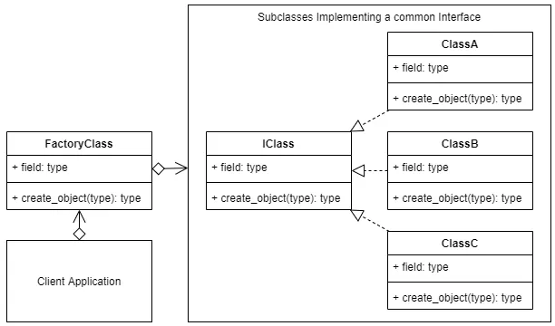

# Abstract Feature Flag

Las feature flags es una estrategia de introducir nuevas 
funcionalidades en una herramienta de software de manera 
incremental y controlada, permitiendo a los desarrolladores 
y usuarios experimentar con la nueva característica antes 
de que esté disponible para todos los usuarios. 
Esto puede ser útil para evitar errores críticos en la 
producción y para recibir retroalimentación temprana de 
los usuarios.

Normalmente las feature flag suelen implementarse con condicionales True o False
con el fin de poder ejecutar el nuevo codigo.

```
if flags.is_active('MY_FLAG'):
  # do the new code
  # return

# do the older code
```

Aunque puede ser un poco más complejo de implementar, las Feature Flags abstractas nos permiten separar las nuevas 
funcionalidades de manera más eficiente.

### Diagrama de clases

